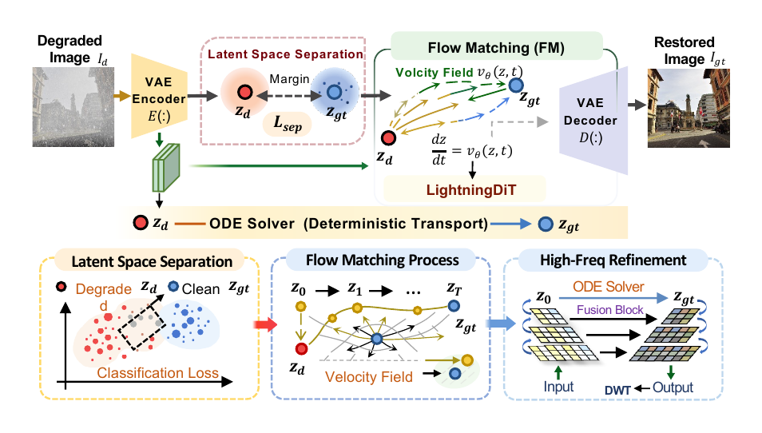

# SLAIR: All-in-One Image Restoration with Latent Space Separation and Deterministic Transport

The PyTorch implementation of **SLAIR**, an all-in-one image restoration framework that restores images in a separated latent space with deterministic transport.

<p align="center">
  
</p>

## Abstract

We propose SLAIR, an all-in-one image restoration framework integrating latent space separation and deterministic transport. We introduce a latent-space separation approach that ensures stable, distinct representations of degraded and clean images, facilitating effective flow matching. By learning continuous transport flow in a latent space via an ordinary differential equation (ODE), our method enables deterministic restoration without relying on degradation labels or stochastic sampling. While the restoration is performed in the latent space, a high-frequency refinement module is introduced into the latent decoder to handle detail distortion during decoding. Experiments demonstrate that SLAIR outperforms existing approaches in terms of both perceptual quality and computational efficiency, making it a robust solution for scalable, degradation-agnostic image restoration.

## Method

SLAIR separates degraded and clean images in the VAE latent space, then learns a deterministic ODE transport flow between the two latent distributions. The pipeline contains three main training stages:

1. Train the VAE/tokenizer.
2. Extract paired latents and train the DiT transport model.
3. Train the high-frequency refinement decoder.

The method overview is also embedded above as [`assets/method.png`](assets/method.png).

## Environment


```bash
conda create -n slair python=3.10 -y
conda activate slair

# Install PyTorch according to your CUDA version.
# Example for CUDA 12.1:
pip install torch torchvision --index-url https://download.pytorch.org/whl/cu121

pip install -r requirements.txt
pip install -r vavae/vavae_requirements.txt

# Configure accelerate before distributed extraction/training/inference.
accelerate config
```

Before training, update dataset/checkpoint paths in the corresponding config files, especially:

- `vavae/configs/train.yaml`
- `tokenizer/configs/vavae_f16d32.yaml`
- `configs/lightningdit_xl_vavae_f16d32.yaml`
- `configs/train.yaml`

## Training

### 1. Train VAE

```bash
cd vavae
python train.py
```

Optional arguments:

```bash
python train.py \
  --config ./configs/train.yaml \
  --seed 42 \
  --logdir /path/to/logs/vae
```

Return to the project root before running the following steps:

```bash
cd ..
```

### 2. Extract Latents

Use the trained VAE/tokenizer config to extract paired latent features:

```bash
bash run_extraction.sh tokenizer/configs/vavae_f16d32.yaml
```

The extraction script calls `extract_paired_features.py`. If needed, edit the default dataset and output paths in `extract_paired_features.py` or the tokenizer config before running.

### 3. Train DiT Transport Model

```bash
bash run_train.sh configs/lightningdit_xl_vavae_f16d32.yaml
```

The DiT config controls the latent dataset paths, VAE settings, checkpoint path, output directory, transport objective, and sampling parameters.

### 4. Train Decoder

```bash
python train_decoder_dit.py
```

Optional arguments:

```bash
python train_decoder_dit.py \
  --config_path ./configs/train.yaml \
  --dit_ckpt_path /path/to/dit/checkpoint.pt \
  --save_dir /path/to/save/decoder
```

## Inference

Run restoration with the trained model config:

```bash
bash run_inference.sh configs/lightningdit_xl_vavae_f16d32.yaml
```

The inference script calls `batch_inference.py` through `accelerate`. Set the model checkpoint, decoder checkpoint, input data, and output paths in `configs/lightningdit_xl_vavae_f16d32.yaml` before running.

## Repository Structure

```text
SLAIR/
|-- assets/
|   `-- method.png                    # Method overview image for README display
|-- configs/                         # DiT, decoder, and training configs
|-- datasets/                        # Dataset and latent dataset loaders
|-- models/                          # LightningDiT and related model modules
|-- src/method.pdf                   # Method document
|-- tokenizer/                       # VAE/tokenizer wrappers and configs
|-- transport/                       # ODE transport and integration utilities
|-- vavae/                           # VAE training code
|-- run_extraction.sh                # Latent extraction entry point
|-- run_train.sh                     # DiT training entry point
|-- run_inference.sh                 # Inference entry point
`-- train_decoder_dit.py             # Decoder refinement training entry point
```

## Acknowledgements
This repo is mainly bulit on [LightningDiT](https://github.com/hustvl/LightningDiT).
